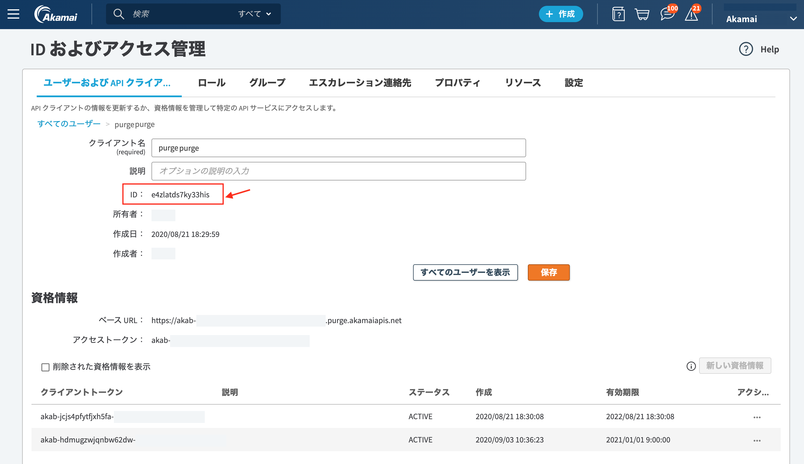

# API経由でCredentialの有効期限を延長する

このドキュメントでは、以下のシナリオを想定して、API経由でAPI Credentialの有効期限を延長するための手順を説明します。

シナリオ
* アカマイのキャッシュ削除の作業をPurge APIで実行している。
* Purge API用のAPI Credentialは有効期限がある。
* Akamai Control Center(ACC)上からAPI Credentialの有効期限を延長することが可能。
* ただし、ACC上での変更はマニュアル操作なので煩わしい、忘れやすい。
* そこで、API経由で、定期的に、かつ、自動的に、上記のAPI Credentialの有効期限を変更する。

アカマイでは歴史的背景からPurgeAPIとそれ以外のAPIとでCredentialを分ける必要があります。
そのため、今回のケースでは以下の2つのAPI Credentialが出てきますので、混同しないように注意ください。

* Purge API用のCredential (有効期限を変更したい対象)
* "Identity Management API"のためのCredential(API Credential情報を操作するためのAPI Credential)

実際の作業としては以下のステップになります。

1. API Credentialを操作するためのAPI Credentialを用意する
2. 有効期限を変更したいAPI ClientのIDを調べる
3. APIを実行して、有効期限を変更する


## 1. API Credentialを操作するためのAPI Credentialを用意する

API Client, Credentialを操作するためには[Identity Management API v1](https://developer.akamai.com/api/core_features/identity_management/v1.html)を使用します。
そのため、この"Identity Management API"のためのCredentialを用意します。

Akamai Control Center(ACC)上のメニューから"ID およびアクセス"を開きます。
新規のAPI Clientを作成する、もしくは、既存のClientに対して以下の権限を追加して、API Credentialを用意します。

* APIサービス名: `Identity Management: API`
* アクセスレベル: `READ-WRITE`
  
ここでは以下の通り`.edgerc`ファイルの`[idm]`セクションとして上記で作成したAPI Credentialを保存しておきます。この後のAPI実行の時に使用します。

```
### .edgerc

[idm]
client_secret = WK/ZD2mjZxxxxxxxxxxxxxxxxxxxpoPtU7iA=
host = akab-kelcinn7u25qk7jv-otbfy5tzblfjim2g.luna.akamaiapis.net
access_token = akab-xxxxxxxxxxxxxxxxxxxxxxxxx
client_token = akab-xxxxxxxxxxxxxxxxxxxxxxxxx
```


## 2. 有効期限を変更したいAPI ClientのIDを調べる

API Clientには固有のID(Client ID)がアサインされており、ACC上の"ID およびアクセス"画面から確認することができます。有効期限を変更したいAPI Client(つまりPurge APIのClient)のClient IDを確認します。



今回の例では、`purgepurge`という名前のPurge API用のClientの有効期限を変更することにします。
上の図の通り、 **ACC上からこのClientのIDは`e4zlatds7ky33his`であるとわかります。**

## 3. APIを実行して、有効期限を変更する

ここからはAPIを実行していきます。ここでの例はPythonを使用します。

### 3.1 Pythonの環境を整える。

必要なパッケージ
* requests
* edgegrid-python
をインストールします。

```
$ pip install requests
$ pip install edgegrid-python
```

続いて、先ほど作成したCredentialファイル`.edgerc`を準備します。ここではPythonのスクリプトと同じディレクトリ内に`.edgerc`を配置します。

```
$ pwd
/Users/foobar   <=現在のディレクトリ

$ ls -a
.edgerc

$ cat .edgerc

[idm]
client_secret = WK/ZD2mjZxxxxxxxxxxxxxxxxxxxpoPtU7iA=
host = akab-kelcinn7u25qk7jv-otbfy5tzblfjim2g.luna.akamaiapis.net
access_token = akab-xxxxxxxxxxxxxxxxxxxxxxxxx
client_token = akab-xxxxxxxxxxxxxxxxxxxxxxxxx
```

この情報からAPIを実行するための変数を定義しておきます。

```
import requests
import json
from akamai.edgegrid import EdgeGridAuth, EdgeRc
from urllib.parse import urljoin

edgerc = EdgeRc('.edgerc')
section = 'idm'
baseurl = 'https://{}'.format(edgerc.get(section, 'host') )
# baseurl => https://akab-kelcinn7u25qk7jv-otbfy5tzblfjim2g.luna.akamaiapis.net


session = requests.Session()
session.auth = EdgeGridAuth.from_edgerc(edgerc, section)

client_id='e4zlatds7ky33his'   ### <= 先ほど調べたClient ID

```

以上で準備は整いました。

### 3.2 有効期限延長する対象のCredential IDを調べる

API Clientは複数のCredentialを発行できます。有効期限はCredentialごとに設定されているので、有効期限を延長するには対象のCredentialを指定する必要がります。そこで使用されるのがCredential IDで、以下のAPIで調べることができます。

```
# get credential id

path='/identity-management/v1/open-identities/{}/credentials'.format(client_id)
# path => /identity-management/v1/open-identities/e4zlatds7ky33his/credentials

url = urljoin(baseurl, path)

ret = session.get( url )
ret_json = json.dumps( ret.json(), indent=2 )
print( ret_json )

#　以下の結果が返ります
# [
#   {
#     "credentialId": 913365,
#     "clientToken": "akab-jcjs4pfytfjxh5fa-i6hzu77lvvpqjy3n",
#     "status": "ACTIVE",
#     "createdOn": "2020-08-21T09:30:08.000Z",
#     "description": "",
#     "expiresOn": "2022-08-21T09:30:08.000Z"
#   },
#   {
#     "credentialId": 914339,
#     "clientToken": "akab-hdmugzwjqnbw62dw-ixiz5fmwq2edfj6g",
#     "status": "ACTIVE",
#     "createdOn": "2020-09-03T01:36:23.000Z",
#     "description": "",
#     "expiresOn": "2021-01-01T00:00:00.000Z"
#   }
# ]
```

通常使用しているCredentialのclient tokenでどのCredentialかを判別できます。ここでは、2つめのCredentialの有効期限を変更することにして、 **そのCredential IDが`914339`だとわかりました。**


## 3.3 有効期限を変更する

あとは、先ほど調べたCredentialのJSONを編集してUpdate(PUT)します。今回は有効期限(`expiresOn`)を`2021-01-01`から`2023-01-01`と2年間延長させてみます。

```
body=json.loads('''
  {
    "credentialId": 914339,
    "clientToken": "akab-hdmugzwjqnbw62dw-ixiz5fmwq2edfj6g",
    "status": "ACTIVE",
    "createdOn": "2020-09-03T01:36:23.000Z",
    "description": "",
    "expiresOn": "2023-01-01T00:00:00.000Z" <== ここを変更した!
  }
''')

cred_id = 914339
path='/identity-management/v1/open-identities/{}/credentials/{}'.format(client_id, cred_id)
url = urljoin(baseurl, path)

ret = session.put(url, json=body)
print( ret.status_code )

# 以下の結果が返ります
# 200
```

以上で有効期限の変更が実施できました。
3.2で実施したAPIを実行すると変更されたかが確認できます。


## 参照

今回のスクリプトの全体になります。

```
### 3.1 Setting Up the Environment

import requests
import json
from akamai.edgegrid import EdgeGridAuth, EdgeRc
from urllib.parse import urljoin

edgerc = EdgeRc('.edgerc')
section = 'idm'
baseurl = 'https://{}'.format(edgerc.get(section, 'host') )

session = requests.Session()
session.auth = EdgeGridAuth.from_edgerc(edgerc, section)

# print(baseurl)

client_id='e4zlatds7ky33his'


### 3.2 Getting Credential ID

path='/identity-management/v1/open-identities/{}/credentials'.format(client_id)
# print(path)

url=urljoin(baseurl, path)
# print(url)

ret = session.get( url )
ret_json = json.dumps( ret.json(), indent=2 )
print( ret_json )


### 3.3 Updating Expiry Date

body=json.loads('''
  {
    "credentialId": 914339,
    "clientToken": "akab-hdmugzwjqnbw62dw-ixiz5fmwq2edfj6g",
    "status": "ACTIVE",
    "createdOn": "2020-09-03T01:36:23.000Z",
    "description": "",
    "expiresOn": "2023-01-01T00:00:00.000Z"
  }
''')

cred_id = 914339
path='/identity-management/v1/open-identities/{}/credentials/{}'.format(client_id, cred_id)
url = urljoin(baseurl, path)
# print(url)

ret = session.put(url, json=body)
print( ret.status_code )
```

